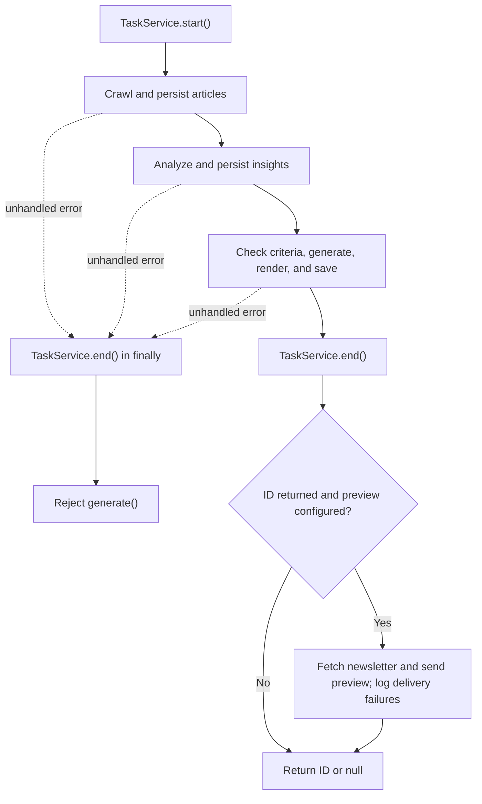

# LLM Newsletter Kit

> **Automate domain-expert newsletters powered by AI**

[

](https://github.com/heripo-lab/llm-newsletter-kit-core/actions/workflows/ci.yml)
[

](https://www.npmjs.com/package/@llm-newsletter-kit/core)


Important: [Code of Conduct](./CODE_OF_CONDUCT.md) • [Security Policy](./SECURITY.md) • [Contributing](./CONTRIBUTING.md)

## What is this?

A type‑first, extensible toolkit that automates LLM‑based newsletter creation end‑to‑end. It orchestrates Crawling → Analysis → Content Generation → Save (with optional preview email), and every stage is swappable via DI‑capable Provider interfaces so you can plug in your own crawlers/LLMs/DB/logging. Built-in operational features include retries, structured logging, partial crawling failure handling, and preview delivery. Your application supplies persistence, scheduling, and subscriber delivery.

- Type-first design (TypeScript, ESM) with strong contracts
- Flexible dependency injection: easily swap Crawling/Analysis/ContentGenerate/Task/Logging/Email
- Operational features built-in: retries, chain options, preview email sending, etc.
- Rollup build (ESM+d.ts), Vitest 100% coverage, GitHub Actions CI included

## Project Background

This project originated from a **Korean cultural heritage newsletter service** called “Research Radar.”

It was architected by **Kim Hongyeon**, a unique **archaeologist-turned-software engineer**. Driven by a question he held for over a decade—**_"Why must research be such grueling manual labor?"_**—he combined his domain expertise with 10+ years of engineering experience to solve this problem.

After completing an academic research project on [A Study on Archaeological Informatization Using Large Language Models (LLMs)](https://poc.heripo.org), a personal automation script created to keep up with academic trends evolved into a service with a high engagement rate (15% CTR) and near-zero maintenance cost.

**Real-world production metrics:**

- **LLM API cost:** $0.2-1 USD per issue with optimized model usage
- **Operational overhead:** Truly hands-off automation—runs 24/7 without human intervention; the only ongoing work is occasional code maintenance
- **Time investment:** Set it up once, let it run indefinitely; it operates while you sleep

**Kim** extracted the generic, high-performance core engine from that service to create this toolkit, allowing other developers to build their own AI-driven media pipelines without starting from scratch.

His design philosophy: **"Logic in code, reasoning in AI, connections in architecture."** This principle guides every aspect of the kit—deterministic workflows are implemented in type-safe code, intelligent analysis is delegated to LLMs, and the entire system is glued together through clean, swappable interfaces.

- **Core (This Repository):** A domain-agnostic, type-safe engine. It orchestrates the full lifecycle (Crawling → Analysis → Content Generation → Save) via DI-capable Providers.
- **Research Radar (Reference Implementation):** A real-world application built with this Core. It serves as a live demo and a "preset" for how to implement the providers.

**Quick Links**

- Research Radar (Live Service): https://heripo.app/research-radar/subscribe
- Source Code (Usage Example): https://github.com/heripo-lab/heripo-research-radar

## Why Code-Based?

Newsletter automation generally falls into two approaches: no-code and code-based. **This kit takes the code-based approach to make domain logic, model choices, and persistence explicit and customizable.**

**Key advantages:**

- **Domain-specific workflows**: Combine tag classification, image context, importance scoring, and newsletter generation with per-stage model and prompt configuration
- **Model and output controls**: Use different models per stage, set the newsletter output token limit, and configure SDK and chain retries
- **Full customization**: Swap any component (crawlers, LLMs, databases, email) via Provider interfaces without vendor lock-in
- **Production-grade**: Type-safe contracts, 100% test coverage, CI/CD integration, and observability built-in

**Real-world output example:**
See the quality for yourself—an actual newsletter generated by this kit: https://heripo.app/research-radar-newsletter-example.html

**Trade-off:** Higher initial setup complexity vs. no-code. This kit mitigates it with strong types, IDE autocompletion, sensible defaults, and a complete reference implementation.

## Installation

```bash
npm i @llm-newsletter-kit/core
```

- Node.js **>= 24** (CI uses 24.x)
- ESM-only distribution: `dist/index.js` and `dist/index.d.ts`; use named imports.
- The core uses AI SDK 7 and Zod 4. Install an AI SDK-compatible model provider separately; provider adapters are development dependencies in this repository, not runtime dependencies of the published package.

## Quick Start

Install the OpenAI adapter for this example:

```bash
npm i @ai-sdk/openai@^4
```

Set `OPENAI_API_KEY` and `OPENAI_MODEL` to your API key and an available model ID that supports structured output. Save the following as `example.ts` in an ESM TypeScript project and run it with your TypeScript runner (for example, `npx tsx example.ts`). This example uses one fictional, preloaded article and in-memory storage; crawling is empty so you can try analysis and generation before connecting a scraper or database. It makes real LLM requests.

```ts
import type {
  ArticleForGenerateContent,
  GenerateNewsletterConfig,
  Newsletter,
} from '@llm-newsletter-kit/core';

import { createOpenAI } from '@ai-sdk/openai';
import { GenerateNewsletter } from '@llm-newsletter-kit/core';

const apiKey = process.env.OPENAI_API_KEY;
const modelId = process.env.OPENAI_MODEL;
if (!apiKey || !modelId) {
  throw new Error('Set OPENAI_API_KEY and OPENAI_MODEL');
}
const model = createOpenAI({ apiKey })(modelId);
const publicationDate = '2026-09-09';
const articles = new Map<string | number, ArticleForGenerateContent>([
  [
    'demo-1',
    {
      id: 'demo-1',
      title: 'Example Lab releases an open research dataset',
      detailContent:
        'Example Lab published an open dataset of 1,000 annotated documents ' +
        'on September 9, 2026 for evaluating document classification.',
      hasAttachedImage: false,
      imageContextByLlm: null,
      tag1: null,
      tag2: null,
      tag3: null,
      targetUrl: 'https://example.com/news',
      publishedDate: publicationDate,
      importanceScore: 0, // Local sentinel for an article awaiting analysis
      contentType: 'Research',
      url: 'https://example.com/news/dataset',
    },
  ],
]);
const newsletters: Newsletter[] = [];

const config: GenerateNewsletterConfig<string> = {
  contentOptions: {
    outputLanguage: 'English',
    expertField: ['Technology', 'AI'],
    freeFormIntro: true,
    // titleContext: 'AI Weekly', // Required substring in the generated title
  },
  dateService: {
    getPublicationISODateString: () => publicationDate,
    getPublicationDisplayDateString: () => 'September 9, 2026',
  },
  taskService: {
    start: async () => `task-${Date.now()}`,
    end: async () => {},
  },
  crawlingProvider: {
    crawlingTargetGroups: [],
    fetchExistingArticlesByUrls: async () => [],
    saveCrawledArticles: async () => 0,
  },
  analysisProvider: {
    classifyTagOptions: { model },
    analyzeImagesOptions: { model }, // Use a multimodal model for real images
    determineScoreOptions: { model },
    fetchUnscoredArticles: async () =>
      [...articles.values()].filter((article) => article.importanceScore === 0),
    fetchTags: async () => ['Research', 'Datasets', 'Document Classification'],
    update: async (article) => {
      const existing = articles.get(article.id);
      if (existing) articles.set(article.id, { ...existing, ...article });
    },
  },
  contentGenerateProvider: {
    model,
    issueOrder: 1,
    newsletterBrandName: 'Tech Insight Weekly',
    publicationCriteria: {
      minimumArticleCountForIssue: 0, // Allow this single-article demo
      priorityArticleScoreThreshold: 8,
    },
    fetchArticleCandidates: async () => [...articles.values()],
    htmlTemplate: {
      html: '<html><body><h1>{{title}}</h1>{{content}}</body></html>',
    },
    saveNewsletter: async ({ newsletter }) => {
      newsletters.push(newsletter);
      return { id: newsletters.length };
    },
  },
  options: {
    logger: {
      info: (message) => console.info(message),
      debug: (message) => console.debug(message),
      error: (message) => console.error(message),
    },
  },
};

const newsletterId = await new GenerateNewsletter(config).generate();
console.log({ newsletterId, newsletter: newsletters.at(-1) });
```

For database-backed providers, real crawling targets, email templates, and delivery integration, see the [Research Radar reference implementation](https://github.com/heripo-lab/heripo-research-radar).

## Configuration & Provider Contracts

The complete configuration type is [GenerateNewsletterConfig](./src/generate-newsletter/models/interfaces.ts). All three providers, `contentOptions`, `dateService`, and `taskService` are required; `options` and `promptProvider` are optional.

| Configuration             | Responsibility                                                                                                          |
| ------------------------- | ----------------------------------------------------------------------------------------------------------------------- |
| `contentOptions`          | `outputLanguage`, `expertField` (string or array), optional `freeFormIntro` and `titleContext`                          |
| `dateService`             | Supply the **newsletter publication date**, including its localized display string; this can be a future scheduled date |
| `taskService`             | Start/end the task; implement locking or duplicate-run prevention in your application                                   |
| `crawlingProvider`        | Supply grouped targets, parsing functions, existing-URL lookup, and persistence                                         |
| `analysisProvider`        | Supply three models, unscored articles, existing tags, and an update function                                           |
| `contentGenerateProvider` | Supply a model, candidates, issue number, brand, HTML template, and newsletter persistence                              |
| `options`                 | Logging, SDK retry count, chain attempt count, and preview email                                                        |
| `promptProvider`          | Replace system/user prompts independently for each LLM stage                                                            |

### Data passed between providers

Crawling results are persisted before analysis reads unscored articles. Analysis updates are persisted before generation reads candidates. The core does not maintain an article database or automatically pass crawled records into the next provider: your provider queries connect the stages.

- `ParsedTargetListItem`: optional `uniqId`, `title`, `date` (`YYYY-MM-DD`), `dateType` (`DateType.REGISTERED` or `DateType.DURATION`), and `detailUrl`.
- `ParsedTargetDetail`: `detailContent` in Markdown, `hasAttachedFile`, and `hasAttachedImage`. A `ParsedTarget` combines both.
- `UnscoredArticle`: `id`, `title`, `detailContent`, `hasAttachedImage`, nullable `imageContextByLlm` and `tag1`/`tag2`/`tag3`, `targetUrl`, and optional `publishedDate`.
- `ArticleForUpdateByAnalysis`: the unscored article plus `importanceScore` (1–10).
- `ArticleForGenerateContent`: the analyzed article plus `contentType` and original detail-page `url`.
- `Newsletter`: `title`, Markdown `content`, rendered `htmlBody`, `issueOrder`, and publication `date`.

`targetUrl` identifies the source/list page; `url` (or `detailUrl` during crawling) identifies an individual article. Map the parsed `date` to `publishedDate` when it represents the original posting date. Your application chooses eligible candidates, including date ranges, already-used articles, and score filters.

`saveNewsletter({ newsletter, usedArticles })` receives **all fetched candidates**, including any the LLM omits from its text. It is not a list of verified citations. Return `{ id: string | number }` after persistence, and handle article relationships in your storage layer.

### Publication criteria

If `publicationCriteria` is supplied, both fields are required by the TypeScript interface. Defaults are `minimumArticleCountForIssue: 5` and `priorityArticleScoreThreshold: 8`.

The current implementation generates only when there is at least one candidate and either:

- candidate count is **greater than** `minimumArticleCountForIssue`; or
- at least one candidate has `importanceScore >= priorityArticleScoreThreshold`.

Thus, five ordinary candidates are skipped with the defaults; six qualify. A single article scoring 8 also qualifies. With no candidates, generation always returns `null`. The count comparison is strict despite the option's name.

### Content and model options

- `freeFormIntro: true` changes the default prompt to begin with an H2 briefing section instead of a separate opening H1/greeting.
- `titleContext` is a required, case-sensitive substring checked against the generated title. The title schema allows 20–70 characters, so choose a phrase that fits.
- `subscribePageUrl` adds a subscription CTA instruction to the default generation prompt.
- `temperature` defaults to `0.3`. `maxOutputTokens`, `topP`, `topK`, `presencePenalty`, and `frequencyPenalty` are forwarded when supplied; otherwise they are unset. In particular, the runtime does not set a `topP` default.
- A generation response with `finishReason: 'length'` throws instead of saving truncated content. Increase `maxOutputTokens` or reduce input articles.
- Analysis uses structured outputs for three tags, image context, and a 1–10 importance score. Models must support the required AI SDK operations; image analysis additionally requires multimodal input.

The default scoring and generation prompts compare deadlines/events against the injected publication date. `publishedDate` provides additional freshness context. `minimumImportanceScoreRules` matches a source's `targetUrl` and changes scoring instructions; it does not clamp the returned score in code. Expiration and source-grounding instructions are prompt behavior, not deterministic filtering or independent fact verification.

### HTML templates

`htmlTemplate` is an object containing `html` and optional `markers`, not a callback. The default placeholders are **`{{title}}` and `{{content}}`**, and all occurrences are replaced in the core pipeline. For custom placeholders:

```ts
const htmlTemplate = {
  html: '<html><body><h1>{{NEWSLETTER_TITLE}}</h1>{{NEWSLETTER_CONTENT}}</body></html>',
  markers: { title: 'NEWSLETTER_TITLE', content: 'NEWSLETTER_CONTENT' },
};
```

The rendering pipeline adds horizontal rules before H2 sections where needed, converts Markdown with `safe-markdown2html` using a JSDOM window (link targets, malformed URL/bold repairs, and strikethrough conversion enabled), inserts the result into the template, then inlines CSS with `juice`. The saved Markdown remains the generated Markdown; `htmlBody` contains the final email HTML.

### Retries, logging, and task lifecycle

| Setting                           | Default | Scope                                                                                                      |
| --------------------------------- | ------- | ---------------------------------------------------------------------------------------------------------- |
| `options.llm.maxRetries`          | `5`     | Passed to the AI SDK for each LLM request                                                                  |
| `options.chain.stopAfterAttempt`  | `3`     | LangChain attempts for each crawling target pipeline, the analysis chain, and the content generation chain |
| `crawlingProvider.maxConcurrency` | `5`     | Concurrent target pipelines within each group                                                              |
| `options.logger`                  | No-op   | Inject an `AppLogger` with `info`, `debug`, and `error`                                                    |

Chain retries can repeat provider reads, LLM calls, and writes; make persistence idempotent. These settings are not a total request or cost cap: incomplete analysis can run up to five additional insight passes, and newsletter generation recursively retries when model-reported language/copyright/factual checks fail or `titleContext` is missing. Those content-validation retries currently have no separate attempt limit.

`generate()` calls `taskService.start()`, runs the pipeline, and calls `taskService.end()` in `finally` after a successful start. Preview delivery runs **after task cleanup**. The method resolves to the saved ID or `null` when skipped; unhandled pipeline or task-service errors reject. Scheduling, cross-process locking, issue-number increments, and subscriber distribution belong to your application.

Structured operation logs include `.start`, `.done`, and `.error` events, task IDs, timing, and context. Result events are `generate.result.created` and `generate.result.skipped`.

### Preview email

For the Quick Start example, add preview configuration before calling `generate()`. Supply your email adapter's `send` implementation:

```ts
import type { EmailService } from '@llm-newsletter-kit/core';

function configurePreview(emailService: EmailService) {
  config.options = {
    ...config.options,
    previewNewsletter: {
      fetchNewsletterForPreview: async () => {
        const newsletter = newsletters.at(-1);
        if (!newsletter) throw new Error('No newsletter saved');
        return newsletter;
      },
      emailService,
      emailMessage: {
        from: 'newsletter@example.com',
        to: ['reviewer@example.com'],
      },
    },
  };
}

// configurePreview(yourEmailService);
```

`previewNewsletter` requires `fetchNewsletterForPreview`, `emailService` (`send(message)`), and `emailMessage` with `from`, `to`, and optional CC/BCC, reply-to, headers, or attachments. The fetch callback receives no ID, so bind it to the newsletter saved by the current run.

The core sets the subject to `[Preview] <title>`, uses `htmlBody` for HTML, and builds a short plain-text issue summary. It skips preview when the result is `null`; fetch/send failures are logged without changing the saved ID returned by `generate()`. This option sends review copies, not a subscriber campaign.

## Customizing LLM Prompts (PromptProvider)

The kit ships with built-in prompts designed to cover a wide range of domains. However, these general-purpose prompts may not be flexible enough for specialized requirements. For example:

- Your domain uses unique terminology or jargon that the default prompts don't account for
- You need a specific newsletter tone or structure (e.g., academic style, casual briefing)
- Tag classification requires domain-specific taxonomy rules
- Importance scoring needs custom criteria tailored to your industry

`PromptProvider` lets you **replace** any built-in prompt — system prompt, user prompt, or both — on a per-stage basis while keeping the rest of the pipeline intact.

### How It Works

PromptProvider is organized by pipeline stage. Every field is optional — omitted prompts fall back to the built-in defaults.

```
PromptProvider
├── analysis
│   ├── classifyTags        — Tag classification (system / user)
│   ├── analyzeImages       — Image analysis (system / user)
│   └── determineImportance — Importance scoring (system / user)
└── contentGenerate
    └── generateNewsletter  — Final newsletter generation (system / user)
```

Each prompt slot is a `PromptBuilder<TContext>` — an object with optional `system` and `user` functions. The function receives a typed context object containing all the data the default prompt would use (articles, tags, expert fields, dates, etc.), so you have full control over prompt construction.

> **Dependency note:** Tag classification and image analysis run in parallel, then feed importance scoring. These stages produce data that flows into the content generation prompt. Changing an analysis prompt may indirectly affect the final newsletter output.

### Example

```ts
import type { PromptProvider } from '@llm-newsletter-kit/core';

const promptProvider: PromptProvider = {
  analysis: {
    // Override only the system prompt for tag classification
    classifyTags: {
      system: (ctx) =>
        `You are a legal-domain specialist. Classify articles using ` +
        `legal taxonomy standards. Available tags: ${ctx.existTags.join(', ')}. ` +
        `Output language: ${ctx.outputLanguage}.`,
      // user prompt falls back to the built-in default
    },
    // Override importance scoring with domain-specific criteria
    determineImportance: {
      system: (ctx) =>
        `Score article importance for ${ctx.expertFields.join(', ')} professionals. ` +
        `Regulatory changes and court rulings score 8+. ` +
        `Commentary and opinion pieces score 3-5.`,
      user: (ctx) =>
        `Article: ${ctx.targetArticle.title}\n` +
        `Content: ${ctx.targetArticle.detailContent}\n` +
        `Score this article 1-10.`,
    },
  },
  contentGenerate: {
    // Override the newsletter generation prompt entirely
    generateNewsletter: {
      system: (ctx) =>
        `You produce a weekly legal digest for "${ctx.newsletterBrandName}". ` +
        `Write in ${ctx.outputLanguage}. Use formal academic tone.`,
      user: (ctx) =>
        `Publication date: ${ctx.dateService.getPublicationDisplayDateString()}\n\n` +
        ctx.targetArticles
          .map((a) => `- [${a.title}](${a.url}) (score: ${a.importanceScore})`)
          .join('\n'),
    },
  },
};

// Add to the config from Quick Start before creating the generator:
config.promptProvider = promptProvider;
```

Prompt builders return strings synchronously. They replace prompts without changing output schemas, image attachments, title checks, or retry behavior. When replacing a prompt, include any date/source/format rules you want to retain.

For full exported context types (`ClassifyTagsPromptContext`, `AnalyzeImagesPromptContext`, `DetermineImportancePromptContext`, and `GenerateNewsletterPromptContext`), see [prompt-provider.ts](./src/generate-newsletter/models/prompt-provider.ts).

## Public API Overview

The package root exports the named `GenerateNewsletter` class and the `DateType` enum, plus provider/configuration, article, crawling, template, prompt, newsletter, date, email, logging, and common types. See the full export list in [src/index.ts](./src/index.ts).

```ts
import type {
  AnalysisProvider,
  ContentGenerateProvider,
  CrawlingProvider,
  GenerateNewsletterConfig,
  PromptProvider,
} from '@llm-newsletter-kit/core';

import { DateType, GenerateNewsletter } from '@llm-newsletter-kit/core';
```

`GenerateNewsletter<TaskId>.generate()` returns `Promise<string | number | null>`. Internal chain classes, LLM query classes, `LoggingExecutor`, and utilities are not exported by the package. Nested option types can be derived from exported types, for example `GenerateNewsletterConfig<string>['contentOptions']`.

## Architecture & Flow

1. Start the task using `TaskService`.
2. Crawl list pages → parse → exclude stored URLs → fetch/parse detail pages → merge and save articles.
3. Read unscored articles and tags → classify tags and analyze images in parallel → score importance → persist updates.
4. Read generation candidates → check publication criteria → generate structured title/Markdown → render HTML and inline CSS → save newsletter and return its ID.
5. End the task, including when the pipeline fails.
6. If configured and a newsletter was created, fetch it and send a preview email.

The three main chains are composed with `@langchain/core/runnables`. AI SDK `generateText` with `Output.object` and Zod schemas handles LLM output. The shared wrapper sets Anthropic's structured-output mode to `jsonTool`.



## Crawling & Parsing Philosophy: "Bring Your Own Scraper"

This kit prioritizes flexibility over rigid tooling. Instead of locking you into a specific scraper (like Puppeteer, Playwright, or Cheerio), we define a strict interface for the pipeline. **We handle the flow; you handle the logic.**

- **Total Freedom:** You can use lightweight HTTP requests for static sites or full headless browsers for complex SPAs. As long as you satisfy the `CrawlingProvider` interface, anything works.
- **Asynchronous Injection:** Parsing logic is injected asynchronously, allowing you to integrate third-party APIs or AI-based parsers effortlessly.
- **Recommendation:** While the kit supports LLM-based parsing (HTML-to-JSON), we generally recommend **rule-based parsing** (e.g., CSS selectors) for production environments to ensure speed, cost-efficiency, and stability.

### Crawling behavior

A `CrawlingTarget` requires `id`, `name`, `url`, `parseList(html)`, and `parseDetail(html)`; either parser can return a value or a promise. Group targets under unique group names, which are used as pipeline keys. The core fetches HTML before invoking parsers; browser rendering or proxy access must be supplied by your integration, such as `customFetch?: typeof fetch`.

- Groups run in parallel. `maxConcurrency` limits target pipelines **per group**, not total HTTP requests. Detail pages within a target are fetched concurrently.
- Existing records are excluded by exact `detailUrl` using `fetchExistingArticlesByUrls`. This is not content-based deduplication or a uniqueness guarantee for duplicates within the same fetched batch.
- The HTTP helper makes up to five attempts for retryable errors, including 429/5xx and recognized network/timeout errors. It uses backoff with jitter, `Retry-After`, randomized User-Agent headers, and an increasing abort timeout for the fetch request. Other 4xx responses are not retried by the helper.
- List fetch/parse failures are logged and yield an empty list for that target. Failed detail fetches and rejected detail-parse promises are logged and omitted while successful items continue. A synchronous throw from `parseDetail` can instead trigger the target pipeline retry.
- Persistence may receive an empty array. Merge processing replaces ASCII double quotes in titles and detail content with smart quotes before saving.

During analysis, existing complete tags and image context are reused. Image analysis reads up to five Markdown image references from `detailContent`; no image flag or no matching references means no image request. Default prompts treat image output as supplementary context rather than precise transcription. Tag/image failures are tolerated, and an importance-query failure falls back to score 1.

## Playground

Playground scripts let you run individual LLM query classes in isolation — no full pipeline needed. Useful for prompt tuning, testing new options, or debugging output quality.

### Setup

1. From a checkout of this repository, install dependencies (the four provider adapters and `tsx` are already declared):

   ```bash
   npm ci
   ```

2. Copy example data files and customize:

   ```bash
   mkdir -p playground/data
   cp playground/data-examples/config.example.json playground/data/config.json
   cp playground/data-examples/articles.example.json playground/data/articles.json
   cp playground/data-examples/template.example.html playground/data/template.html
   ```

3. Edit `playground/data/config.json` with your provider, API key, available model ID, and options. Supported playground providers are `openai`, `anthropic`, `google`, and `togetherai`. The example overrides newsletter generation with Anthropic: replace that key/model or remove the `models.generateNewsletter` override. Set `isoDate` and `displayDate` to the intended publication date.
4. Edit `playground/data/articles.json` with your target articles. Both camelCase field names (`detailContent`, `targetUrl`, …) and snake_case DB dumps (`detail_content`, `target_url`, …) are accepted — snake_case records are normalized automatically.
5. (Optional) Replace `playground/data/template.html` with your actual email template.

### Custom Prompts (optional)

To test custom LLM prompts per pipeline stage (the `PromptProvider` interface), copy the example prompt module and edit it:

```bash
cp playground/data-examples/prompts.example.ts playground/data/prompts.ts
```

Every builder in `prompts.ts` is optional — delete the ones you don't want to override and those stages fall back to the built-in default prompts. The module must default-export a `PromptProvider` object. Each LLM playground script logs whether it is running with custom or default prompts.

Prompt builders receive their values (`expertFields`, `outputLanguage`, `targetArticle`, `dateService`, …) as arguments rather than reading config directly, so a prompt module written this way works unchanged across different configurations. Those argument values come from `config.json` and `articles.json`.

### Per-stage models (optional)

Production pipelines often mix providers — a cheap model for tagging, a multimodal one for images, a stronger one for the final newsletter. Add a `models` block to override any stage; omitted fields fall back to the top-level `provider` / `apiKey` / `model`:

```json
{
  "provider": "openai",
  "apiKey": "sk-...",
  "model": "YOUR_OPENAI_MODEL",
  "models": {
    "analyzeImages": { "model": "YOUR_OPENAI_MODEL" },
    "generateNewsletter": {
      "provider": "anthropic",
      "apiKey": "sk-ant-...",
      "model": "YOUR_ANTHROPIC_MODEL"
    }
  }
}
```

Use model IDs available to your account. A stage override inherits each omitted field independently, so changing `provider` also requires the appropriate API key and model. The core itself accepts injected AI SDK `LanguageModel` instances and is not limited to these four playground adapters.

### Generation options (optional)

Sampling and output limits for the newsletter generation stage. Omitted values use the core defaults (`temperature: 0.3`, everything else unset):

```json
{
  "generation": {
    "temperature": 0.3,
    "maxOutputTokens": 32000
  }
}
```

Set `maxOutputTokens` when generating long newsletters — the generation query throws if the model stops on the token limit (`finishReason: "length"`).

### Run

Each pipeline stage can be run in isolation:

```bash
npm run playground:classify-tags          # ❶ Tag classification
npm run playground:analyze-images         # ❷ Image analysis (multimodal model required)
npm run playground:determine-importance   # ❸ Importance scoring
npm run playground:generate-newsletter    # ❹ Newsletter generation
```

The scripts read the same input file independently: they do not write analysis results back into `articles.json` or chain their outputs. Update the input data yourself when testing later stages. The generation playground bypasses publication criteria, task services, database persistence, and email delivery. Playground SDK retries default to 3, compared with 5 in the full pipeline.

To compare a custom prompt module with the built-in prompts without LLM calls:

```bash
npm run playground:verify-prompts
```

This requires the local config and at least one article. It compares rendered strings across predefined scenarios and exits with code 1 if they differ. Intentional customizations can therefore fail this equivalence check; it is not a prompt-quality evaluation.

### Output

Results are saved to `playground/output/` (git-ignored):

- `classify-tags.md` — Assigned tags per article
- `analyze-images.md` — Image analysis context per article
- `determine-importance.md` — Importance score table
- `newsletter.md` — Generated markdown with title in frontmatter
- `newsletter.html` — Rendered HTML with CSS inlined (juice)
- `usage.md` — Token usage report (newsletter generation)

### Data Management

| Directory                   | Git     | Purpose                                 |
| --------------------------- | ------- | --------------------------------------- |
| `playground/data-examples/` | Tracked | Format reference files (`.example.*`)   |
| `playground/data/`          | Ignored | Your actual config, articles, templates |
| `playground/output/`        | Ignored | Generated results                       |

## Development / Build / Test / CI

Use Node.js 24 or newer and npm:

```bash
npm ci
npm run format:check
npm run lint:ci
npm run typecheck
npm run build
npm run test:ci
```

The [CI workflow](./.github/workflows/ci.yml) runs these checks on pull requests to any branch and manual dispatches, using Node.js 24.x. Rollup emits ESM JavaScript, a source map, and bundled declarations in `dist/`. Vitest uses the Node environment and V8 coverage with 100% thresholds for lines, branches, functions, and statements; the entry point and model/type files are excluded from coverage.

For local iteration, use `npm run test:watch`, `npm run test:coverage`, `npm run lint:fix`, and `npm run format`. For the contribution workflow and release scripts, see [CONTRIBUTING.md](./CONTRIBUTING.md); [package.json](./package.json) defines the current runtime requirement and commands.

## Contributing & Policies

Please refer to [CONTRIBUTING.md](./CONTRIBUTING.md) for all contribution guidelines and project policies, including:

- Issue labels and triage
- Branch strategy and PR process
- Versioning and release policy
- CI workflow and coverage requirements

## Citation & Attribution

If you use this project in your research, service, or derivative works, please include the following attribution:

```
Powered by LLM Newsletter Kit
```

This acknowledgment helps support the open source project and gives credit to its contributors.

### BibTeX Citation

For academic papers or research documentation, you may use the following BibTeX entry:

```bibtex
@software{llm_newsletter_kit,
  author = {Kim, Hongyeon},
  title = {LLM Newsletter Kit: Type-First Extensible Toolkit for Automating LLM-Based Newsletter Creation},
  year = {2025},
  url = {https://github.com/heripo-lab/llm-newsletter-kit-core},
  note = {Apache License 2.0}
}
```

## Sponsor

If you’d like to support heripo lab's open-source research, you can sponsor us through:

- [Open Collective](https://opencollective.com/heripo-project) for general project sponsorship.
- [fairy.hada.io/@heripo](https://fairy.hada.io/@heripo) for Korean individual supporters who prefer KRW payments.

## License

Apache-2.0 © 2025-present kimhongyeon. See LICENSE and NOTICE for details.
